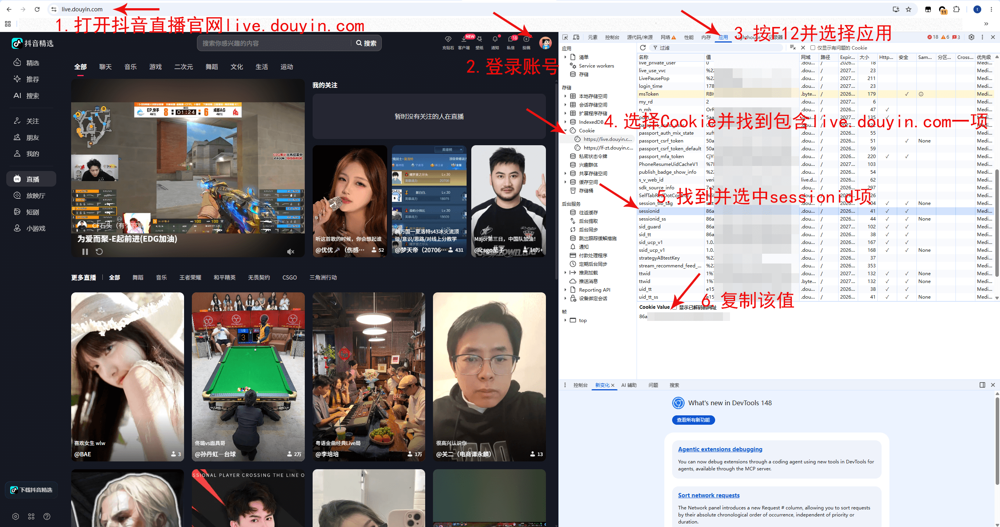
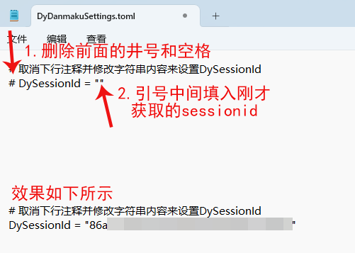
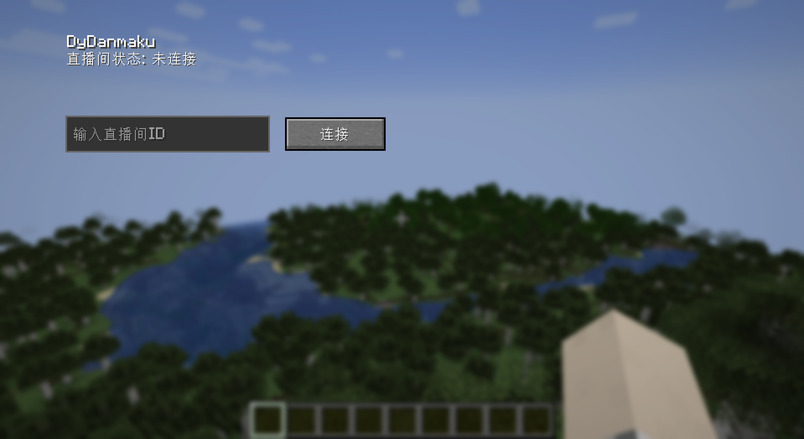
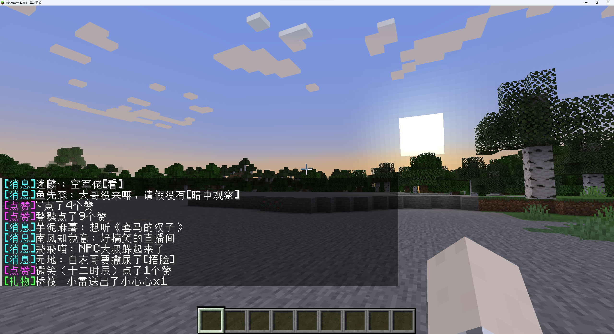
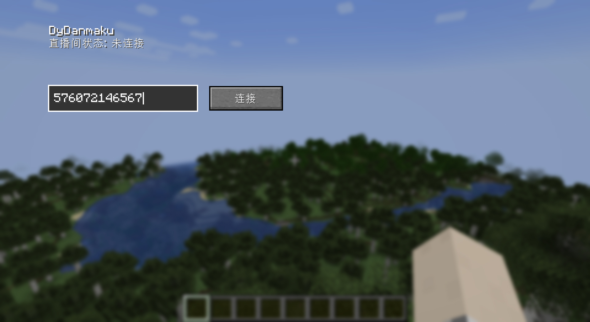
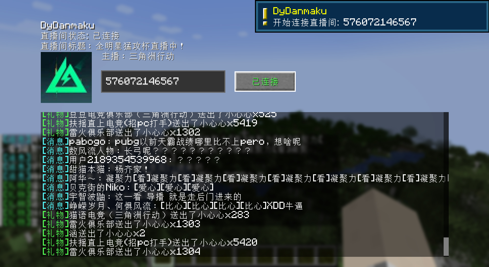

# DyDanmaku

一个用于在聊天框接收抖音直播弹幕的Minecraft模组

<!-- PROJECT LOGO -->
<br />

<p align="center">
  <a href="https://github.com/tiangalon/DyDanmaku/">
    
  </a>

  <h3 align="center">抖音弹幕获取</h3>
  <p align="center">
    在Minecraft游戏内接收你的 <s>或者别人的</s> 直播间弹幕
    <br />
    <a href="https://github.com/tiangalon/DyDanmaku"><strong>探索本项目的文档 &raquo;</strong></a>
    <br />
    <br />
    <a href="https://www.mcmod.cn/class/17853.html">MCMOD</a>
    &middot;
    <a href="https://github.com/tiangalon/DyDanmaku/issues">报告Bug</a>
    &middot;
    <a href="https://github.com/tiangalon/DyDanmaku/issues">提出新特性</a>
  </p>
</p>

> **注意：** 该模组正处于早期开发阶段，支持版本较少，且仅为单人游戏设计，可能会出现bug或者是兼容性问题，请谨慎使用。
>
> **注意：** 该模组仅供学习交流使用，请勿用于商业，甚至是违法犯罪用途，违者后果自负。

## 目录

- [写在前面](#写在前面)
- [使用指南](#使用指南)
  - [游戏环境要求](#游戏环境要求)
  - [安装方法](#安装方法)
  - [使用方法](#使用方法)
- [效果图](#效果图)
- [后续改进计划](#后续改进计划)
- [鸣谢](#鸣谢)
  - [部分依赖来源](#部分依赖来源)
  - [灵感来源](#灵感来源)

## 写在前面

本人偶尔在抖音直播mc，用直播伴侣的时候看弹幕比较麻烦，而且会发生严重的掉帧，于是想到有没有模组能直接把弹幕发送到游戏内，这样抓取一下推流码即可实现完全摆脱直播伴侣。

去搜了下，发现 [BakaDanmaku](https://github.com/TartaricAcid/BakaDanmaku) 可实现类似的功能，可惜仅支持b站弹幕，所以照着它的效果图写了个抖音版的。

没有参考代码，但是参考了起名(

期间还有个试做品 [dy_danmaku_java](https://github.com/tiangalon/dy_danmaku_java)，代码思路差不多，也许参考意义更大。

## 使用指南

### 游戏环境要求

1. Minecraft 1.20.1~26.1.2（更多版本待日后支持，提issue可能加急）
2. fabric 0.19.2及以上

### 安装方法

1. 从release中下载对应版本的jar文件（当前最新版本0.1.6）
2. 准备好符合上述要求的游戏环境
3. 丢进 .minecraft/mods 里面

### 使用方法

<details>
<summary><b>前置步骤：设置模组配置（可选）</b></summary>
<br>

模组的缓存与配置文件存放于游戏版本文件夹中 `config/dydanmaku` 目录下，其中 `DyDanmakuSettings.toml` 为本模组配置文件，启动一次游戏后自动生成。

由于抖音官方政策的限制，现在需要配置用户sessionid才可获取礼物等全部弹幕信息，因此需要自行从官网cookies中复制该值并加入配置文件。

> 不配置不影响mod正常使用，若无需配置可直接进入下一步。

**sessionid的获取与配置方法：**

1. 进入 [抖音直播官网](https://live.douyin.com/) 并登录自己账号
2. 打开浏览器开发者工具，一般快捷键为 `F12`（下面以谷歌浏览器为例，其他浏览器自行寻找方法）
3. 找到 Cookie 中 `sessionid` 的值并复制（具体方法参考下图）



4. 在游戏版本文件夹 `/config/dydanmaku/DyDanmakuSettings.toml` 中配置 `sessionid`



</details>

#### 第一步：进入游戏内世界

启动游戏，进入任意一个单人世界。

#### 第二步：连接直播间

提供以下两种连接方式，任选其一即可：

**方式一：通过 GUI 连接**

按下 `F7`（默认按键，可在游戏内更改按键绑定），打开 GUI，点击"连接"按钮。



**方式二：通过命令连接**

```java
/dydanmaku connect [live_id]
```

> `live_id` 即抖音直播间链接最后的数字部分。例如直播间链接为 `https://live.douyin.com/1234567890`，则输入 `/dydanmaku connect 1234567890`。

#### 第三步：断开直播间连接

输入以下命令断开连接：

```java
/dydanmaku disconnect
```

也可以点击 GUI 界面上的"已连接（断开）"按钮。

#### 第四步：查看连接状态

输入以下命令查看当前连接直播间的状态：

```java
/dydanmaku status
```

> **注意：** 一次只能连接一个直播间，想连接新的直播间需要先断开原来的连接。

## 效果图

（图中连接直播间在首页随便找的）





## 后续改进计划

1. 添加对Forge以及更多游戏版本的支持
2. 添加json文件配置，通过修改文件自定义弹幕输出文本

## 鸣谢

### 部分依赖来源

- [protobuffers](https://github.com/protocolbuffers/protobuf)
- [netty](https://netty.io/)
- [toml4j](https://github.com/mwanji/toml4j)
- [nashorn](https://github.com/openjdk/nashorn)
- [dy_danmaku_java](https://github.com/tiangalon/dy_danmaku_java)

### 灵感来源

- [BakaDanmaku](https://github.com/TartaricAcid/BakaDanmaku)
